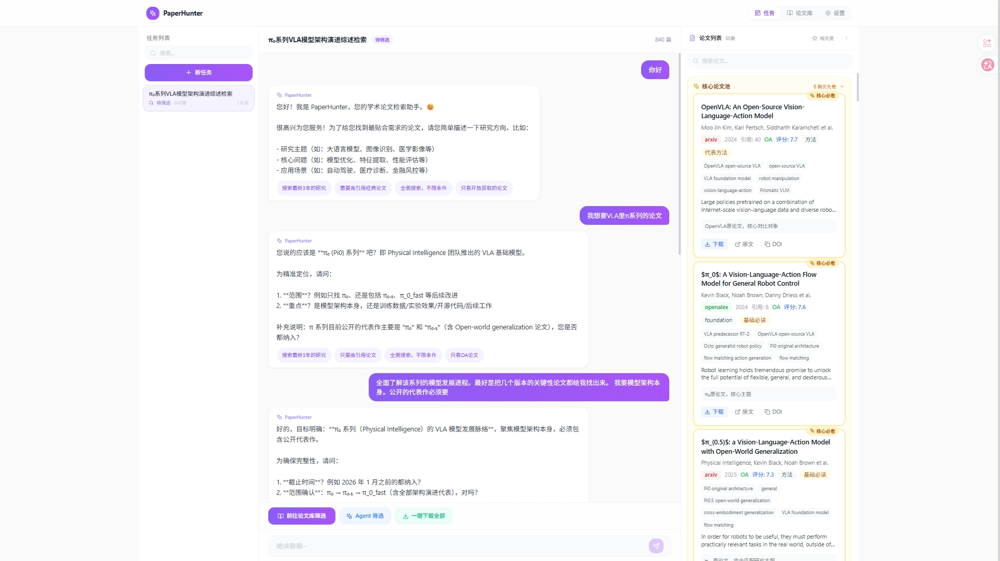
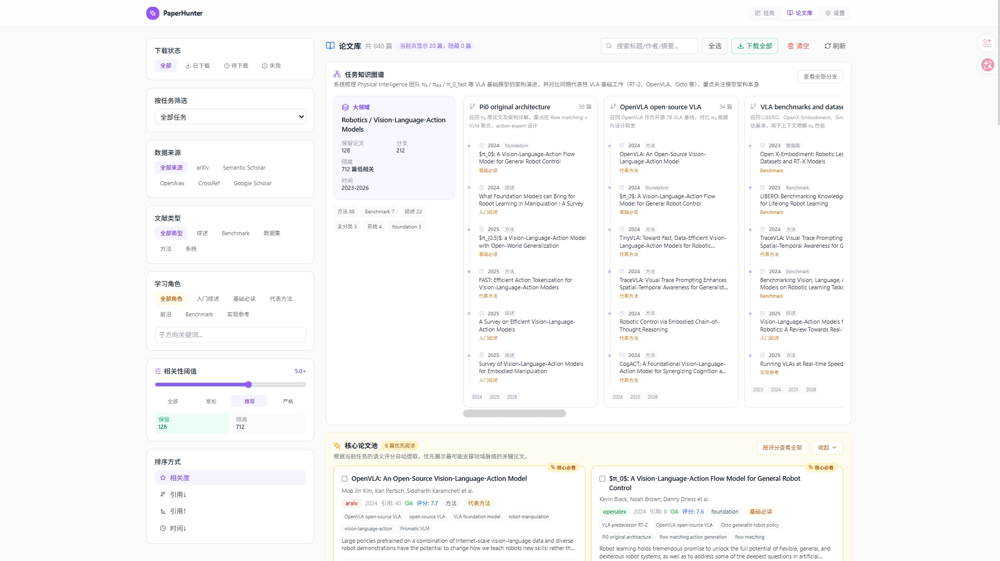
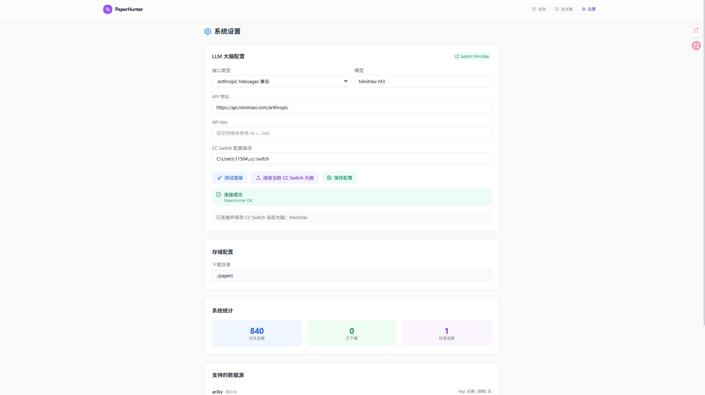

# PaperHunter — 论文搜索 Agent 团队

> 基于 CrewAI 的多智能体论文搜索、筛选、下载系统，配备 Web 实时监控与内嵌聊天

## 项目预览

PaperHunter 面向“研究方向探索、论文溯源、核心文献筛选”这类真实科研场景：用户可以先通过聊天 Agent 澄清需求，系统再自动生成结构化检索方案，多源召回论文，并用 LLM 对论文进行语义评分、分支标注和核心论文提取。

### 1. 聊天式研究需求澄清与核心论文实时浮出



聊天 Agent 会主动追问研究范围、时间线、代表模型和筛选偏好；检索过程中右侧论文库会实时入库，并将最值得优先阅读的论文放入“核心论文池”。

### 2. 论文库知识图谱、分支追溯与相关性阈值清洗



论文库支持按任务分支展示论文脉络，用户可以通过相关性阈值实时隐藏低相关论文，将噪声论文隔离到低相关区，同时保留人工复核入口。

### 3. 可替换 LLM 大脑与 CC Switch 自动连接



设置页支持 Anthropic/OpenAI 兼容接口，并可自动连接本机 CC Switch 当前启用的大脑，方便在不同模型服务之间切换。

---

## 项目简介

PaperHunter 是一个 AI Agent 团队，帮助研究人员从全球主要学术来源**自动搜索、智能筛选、批量下载**论文 PDF。系统通过 Web 前端实时展示 Agent 执行状态，并支持内嵌聊天与用户随时沟通需求调整。

---

## 快速部署指南

### 环境要求

| 依赖                    | 版本要求 | 说明                                       |
| ----------------------- | -------- | ------------------------------------------ |
| **Python**        | ≥ 3.11  | 推荐 3.11 或 3.12                          |
| **Node.js**       | ≥ 18    | 推荐 LTS 版本                              |
| **Conda**（可选） | —       | 推荐用 Conda 管理 Python 环境，也可用 venv |

### Step 1：克隆项目

```bash
git clone https://gitee.com/MrJQ123321/paperhunter.git
cd paperhunter
```

### Step 2：配置环境变量

```bash
# 复制环境变量模板
cp .env.example .env
```

编辑 `.env`，填入你的 API Key：

```env
# 必填：LLM API 配置（兼容 Anthropic 格式的 API）
LLM_API_KEY=sk-your-api-key-here
LLM_BASE_URL=https://api.anthropic.com
LLM_MODEL=claude-sonnet-4-20250514

# 以下为可选配置，不填也能运行
SEMANTIC_SCHOLAR_API_KEY=      # Semantic Scholar API Key，提高搜索限额
UNPAYWALL_EMAIL=you@email.com  # 用于查找论文的 OA 版本
PROXY_URL=                     # 代理地址（访问 Google Scholar 等需要）
```

### Step 3：安装后端依赖

```bash
# 方式 A：使用 Conda（推荐）
conda create -n paperhunter python=3.11 -y
conda activate paperhunter
pip install -e .

# 方式 B：使用 venv
python -m venv .venv
# Windows:
.venv\Scripts\activate
# macOS/Linux:
source .venv/bin/activate
pip install -e .
```

### Step 4：安装前端依赖

```bash
cd frontend
npm install
cd ..
```

### Step 5：启动项目

**方式 A：一键启动（Windows）**

```bash
start.bat
```

会自动打开两个终端窗口（后端 + 前端），等待 5 秒后自动打开浏览器。

**方式 B：手动启动**

```bash
# 终端 1：启动后端
uvicorn backend.main:app --reload --port 8000

# 终端 2：启动前端
cd frontend
npm run dev
```

然后手动打开 http://localhost:3000

### Step 6：验证部署

1. 打开浏览器访问 http://localhost:3000
2. 页面应自动加载已有任务列表（首次为空）
3. 在聊天框输入研究主题，如 "Vision Language Action model"
4. 与聊天助手确认搜索方案后，输入「开始检索」或点击开始按钮
5. 观察 4 个 Agent 的实时执行状态
6. 任务完成后，可在右侧论文面板查看和交互论文

### 常见问题

| 问题                              | 解决方案                                                            |
| --------------------------------- | ------------------------------------------------------------------- |
| `pip install` 报错              | 确认 Python 版本 ≥ 3.11：`python --version`                      |
| `npm install` 报错              | 确认 Node.js 版本 ≥ 18：`node --version`                         |
| 后端启动报`ModuleNotFoundError` | 确认已激活正确的 Python 环境                                        |
| 前端页面空白                      | 检查后端是否在 8000 端口运行：访问 http://localhost:8000/api/health |
| LLM 调用失败                      | 检查`.env` 中的 `LLM_API_KEY` 和 `LLM_BASE_URL` 是否正确      |
| 搜索无结果                        | 检查网络连接，部分数据源（Semantic Scholar、OpenAlex）需要外网访问  |
| 下载 PDF 失败                     | 多数论文有 OA 版本，确保`UNPAYWALL_EMAIL` 已配置                  |

---

## 一、系统架构总览

```
┌─────────────────────────────────────────────────────────────────┐
│                        Web 前端 (React)                         │
│  ┌──────────────┐  ┌──────────────┐  ┌──────────────────────┐  │
│  │ 任务监控面板   │  │ Agent 状态流  │  │ 内嵌聊天窗口          │  │
│  │ (执行进度/日志) │  │ (实时 WebSocket)│ │ (与 Agent 实时对话)   │  │
│  └──────┬───────┘  └──────┬───────┘  └──────────┬───────────┘  │
└─────────┼─────────────────┼─────────────────────┼───────────────┘
          │                 │                     │
          ▼                 ▼                     ▼
┌─────────────────────────────────────────────────────────────────┐
│                  FastAPI 后端 (Python)                           │
│  ┌──────────┐  ┌──────────┐  ┌──────────┐  ┌───────────────┐  │
│  │ REST API  │  │WebSocket │  │ 聊天路由  │  │ 任务调度器     │  │
│  │ (CRUD)    │  │ (实时推送) │  │ (消息分发)│  │ (CrewAI 编排) │  │
│  └──────────┘  └──────────┘  └──────────┘  └───────┬───────┘  │
└─────────────────────────────────────────────────────┼───────────┘
                                                      │
┌─────────────────────────────────────────────────────┼───────────┐
│                 CrewAI Agent 团队                    │           │
│  ┌──────────┐  ┌──────────┐  ┌──────────┐  ┌──────┴────────┐ │
│  │ Search   │  │ Filter   │  │ Download │  │ Chat          │ │
│  │ Agent    │  │ Agent    │  │ Agent    │  │ Agent         │ │
│  │ (多源搜索)│  │ (智能筛选)│  │ (PDF下载) │  │ (用户交互)    │ │
│  └──────────┘  └──────────┘  └──────────┘  └───────────────┘ │
└───────────────────────────────────────────────────────────────┘
          │                │                │
          ▼                ▼                ▼
┌───────────────────────────────────────────────────────────────┐
│                      外部学术数据源                             │
│  arXiv │ Semantic Scholar │ OpenAlex │ CrossRef │ Google Scholar│
└───────────────────────────────────────────────────────────────┘
          │
          ▼
┌───────────────────────────────────────────────────────────────┐
│                      本地存储                                   │
│  SQLite (论文元数据)  +  ./papers/ (PDF 文件按任务分类)          │
└───────────────────────────────────────────────────────────────┘
```

---

## 二、4 个 Agent 角色定义

### 1. Search Agent（搜索专家）

| 属性           | 配置                                                                                                               |
| -------------- | ------------------------------------------------------------------------------------------------------------------ |
| **角色** | 学术搜索专家                                                                                                       |
| **目标** | 从多个学术数据源全面搜索论文，确保覆盖广泛                                                                         |
| **模型** | Claude Sonnet (中等复杂度，需要理解搜索策略)                                                                       |
| **工具** | `arxiv_search`, `semantic_scholar_search`, `openalex_search`, `crossref_search`, `google_scholar_search` |
| **输出** | 去重后的论文列表(标题、作者、摘要、DOI、来源链接)                                                                  |

- **数据源**:

  | 数据源           | 覆盖范围                  | API                 | 限制         |
  | ---------------- | ------------------------- | ------------------- | ------------ |
  | arXiv            | 预印本(物理/CS/Math/生物) | 免费，无需 key      | 无           |
  | Semantic Scholar | 2亿+ 论文，含引用关系     | 免费，有 rate limit | 100 req/5min |
  | OpenAlex         | 2.5亿+ 学术作品           | 完全免费开放        | 100k req/day |
  | CrossRef         | DOI 元数据(出版商)        | 免费                | 50 req/s     |
  | Google Scholar   | 最广泛覆盖                | 需代理/scraping     | 易被封       |
- **Backstory**:

  > 你是一位经验丰富的学术研究助理，擅长从多个学术数据库中高效检索论文。你了解各数据源的特点和覆盖范围，能够制定最优的搜索策略。你会并行查询多个源，去重合并结果，并确保不遗漏重要论文。
  >

### 2. Filter Agent（筛选专家）

| 属性           | 配置                                     |
| -------------- | ---------------------------------------- |
| **角色** | 论文质量评审专家                         |
| **目标** | 根据用户需求智能筛选论文，排序推荐       |
| **模型** | Claude Sonnet (需要语义理解能力)         |
| **工具** | `database_query`, `relevance_scorer` |
| **输出** | 排序后的推荐论文列表，附带筛选理由       |

- **筛选维度**:

  | 维度       | 权重 | 评分方法                                                 | 分值范围 |
  | ---------- | ---- | -------------------------------------------------------- | -------- |
  | 语义相关性 | 40%  | LLM 对摘要与查询主题的匹配度评分                         | 0-10     |
  | 引用数     | 20%  | `log10(citations + 1) / log10(max_citations + 1) * 10` | 0-10     |
  | 时效性     | 15%  | 近 1 年=10, 近 3 年=8, 近 5 年=6, 更早=4                 | 4-10     |
  | 可获取性   | 15%  | OA=10, Unpaywall 找到=7, 需付费=3                        | 3-10     |
  | 来源可信度 | 10%  | 顶刊/顶会=10, 一般期刊=7, 预印本=5                       | 5-10     |

  **综合评分** = Σ(维度分 × 权重)，满分 10 分
- **批量评分优化**：一次 LLM 调用评估 10 篇论文的相关性，降低 API 成本
- **Backstory**:

  > 你是一位学术论文评审专家，能够快速评估论文的质量和相关性。你会根据用户的研究方向，从大量搜索结果中筛选出最有价值的论文，并给出清晰的筛选理由。你重视高引用数、权威期刊和最新发表的论文。
  >

### 3. Download Agent（下载专家）

| 属性           | 配置                                                       |
| -------------- | ---------------------------------------------------------- |
| **角色** | 论文下载与文件管理专家                                     |
| **目标** | 高效下载论文 PDF，按规则分类存储                           |
| **模型** | Claude Haiku (低复杂度，主要是执行下载任务)                |
| **工具** | `pdf_downloader`, `unpaywall_lookup`, `file_manager` |
| **输出** | 下载成功/失败报告，失败论文记录原因                        |

- **下载策略**:
  1. 优先从开放获取(OA)源直接下载
  2. 通过 Unpaywall API 查找合法 OA 版本
  3. 通过出版商 API（Springer/Elsevier）下载（需 API key）
  4. 从 arXiv/PubMed Central 等开放仓库下载
- **文件命名**: `{任务名称}/{作者}_{年份}_{标题}_{论文ID前8位}.pdf`
- **Backstory**:
  > 你是一位论文下载专家，熟悉各种学术论文的获取渠道。你会优先使用合法的开放获取途径，确保下载的 PDF 文件完整可用。你会按规则对文件进行分类存储，并记录下载失败的原因。
  >

### 4. Chat Agent（交互专家）

| 属性           | 配置                                       |
| -------------- | ------------------------------------------ |
| **角色** | 用户交互协调员                             |
| **目标** | 理解用户需求，协调其他 Agent，实时汇报进度 |
| **模型** | Claude Sonnet (需要强对话能力)             |
| **工具** | `websocket_sender`, `task_manager`     |
| **输出** | 聊天消息、进度报告、快捷回复选项           |

- **能力**:
  - 解析用户的自然语言搜索需求
  - 向用户确认筛选偏好
  - 汇报搜索/下载进度
  - 接收用户的实时调整指令（"排除综述类论文"、"只要近 3 年的"等）
- **Backstory**:
  > 你是一位友好的研究助理，负责与用户沟通。你会用简洁清晰的语言汇报工作进展，主动询问用户的偏好，并提供快捷选项方便用户操作。当用户需求不明确时，你会追问确认。
  >

---

## 三、数据模型定义

### 3.1 Paper 模型（论文）

```python
# backend/models/paper.py
from pydantic import BaseModel
from datetime import datetime
from enum import Enum

class PaperSource(str, Enum):
    ARXIV = "arxiv"
    SEMANTIC_SCHOLAR = "semantic_scholar"
    OPENALEX = "openalex"
    CROSSREF = "crossref"
    GOOGLE_SCHOLAR = "google_scholar"

class Paper(BaseModel):
    id: str                          # 内部唯一 ID (UUID)
    title: str                       # 论文标题
    authors: list[str]               # 作者列表
    abstract: str                    # 摘要
    doi: str | None                  # DOI
    url: str                         # 原始链接
    pdf_url: str | None              # PDF 直链
    source: PaperSource              # 来源
    published_date: datetime | None  # 发表日期
    citation_count: int | None       # 引用数
    venue: str | None                # 期刊/会议
    is_open_access: bool             # 是否开放获取
    topics: list[str]                # 主题标签
    local_pdf_path: str | None       # 本地 PDF 路径
    download_status: str             # pending / downloading / done / failed
    relevance_score: float | None    # 相关性评分 (0-1)
    created_at: datetime
```

### 3.2 Task 模型（任务）

```python
# backend/models/task.py
class TaskStatus(str, Enum):
    PENDING = "pending"
    RUNNING = "running"
    PAUSED = "paused"
    COMPLETED = "completed"
    FAILED = "failed"
    CANCELLED = "cancelled"

class Task(BaseModel):
    id: str                          # 任务 ID
    query: str                       # 搜索主题
    sources: list[PaperSource]       # 使用的数据源
    filters: dict                    # 筛选条件 (year_min, citations_min, etc.)
    status: TaskStatus
    total_papers_found: int          # 搜索到的论文总数
    papers_after_filter: int         # 筛选后论文数
    papers_downloaded: int           # 已下载论文数
    papers_failed: int               # 下载失败论文数
    created_at: datetime
    updated_at: datetime
    error_message: str | None
```

### 3.3 Message 模型（聊天消息）

```python
# backend/models/message.py
class MessageRole(str, Enum):
    USER = "user"
    AGENT = "agent"
    SYSTEM = "system"

class Message(BaseModel):
    id: str
    task_id: str                     # 关联的任务 ID
    role: MessageRole
    content: str
    suggestions: list[str]           # Agent 提供的快捷回复选项
    timestamp: datetime
    agent_name: str | None           # 来自哪个 Agent
```

### 3.4 数据库 Schema (SQLite)

```sql
-- papers 表
CREATE TABLE papers (
    id TEXT PRIMARY KEY,
    title TEXT NOT NULL,
    authors TEXT,                    -- JSON array
    abstract TEXT,
    doi TEXT UNIQUE,
    url TEXT NOT NULL,
    pdf_url TEXT,
    source TEXT NOT NULL,
    published_date TEXT,
    citation_count INTEGER,
    venue TEXT,
    is_open_access BOOLEAN DEFAULT 0,
    topics TEXT,                     -- JSON array
    local_pdf_path TEXT,
    download_status TEXT DEFAULT 'pending',
    relevance_score REAL,
    created_at TEXT NOT NULL
);
CREATE INDEX idx_papers_doi ON papers(doi);
CREATE INDEX idx_papers_title ON papers(title);
CREATE INDEX idx_papers_source ON papers(source);

-- tasks 表
CREATE TABLE tasks (
    id TEXT PRIMARY KEY,
    query TEXT NOT NULL,
    sources TEXT,                    -- JSON array
    filters TEXT,                    -- JSON object
    status TEXT DEFAULT 'pending',
    total_papers_found INTEGER DEFAULT 0,
    papers_after_filter INTEGER DEFAULT 0,
    papers_downloaded INTEGER DEFAULT 0,
    papers_failed INTEGER DEFAULT 0,
    created_at TEXT NOT NULL,
    updated_at TEXT NOT NULL,
    error_message TEXT
);

-- messages 表
CREATE TABLE messages (
    id TEXT PRIMARY KEY,
    task_id TEXT NOT NULL,
    role TEXT NOT NULL,
    content TEXT NOT NULL,
    suggestions TEXT,                -- JSON array
    timestamp TEXT NOT NULL,
    agent_name TEXT,
    FOREIGN KEY (task_id) REFERENCES tasks(id)
);
CREATE INDEX idx_messages_task ON messages(task_id);
```

---

## 四、项目结构

```
paperhunter/
├── pyproject.toml                  # Python 项目配置
├── .env                            # API 密钥（不入 Git）
├── .env.example                    # 环境变量模板
│                                   #   LLM_API_KEY=sk-xxx
│                                   #   LLM_BASE_URL=https://api.anthropic.com
│                                   #   SEMANTIC_SCHOLAR_API_KEY=xxx (可选)
│                                   #   SPRINGER_API_KEY=xxx (可选)
│                                   #   ELSEVIER_API_KEY=xxx (可选)
│                                   #   UNPAYWALL_EMAIL=researcher@example.com
│                                   #   PROXY_URL=http://proxy:port (可选)
│                                   #   DOWNLOAD_DIR=./papers
│                                   #   DB_PATH=./data/papers.db
│
├── backend/                        # Python 后端
│   ├── main.py                     # FastAPI 入口
│   ├── config.py                   # 配置管理
│   ├── database.py                 # SQLite 数据库
│   │
│   ├── agents/                     # CrewAI Agent 定义
│   │   ├── __init__.py
│   │   ├── search_agent.py         # 搜索专家
│   │   ├── filter_agent.py         # 筛选专家
│   │   ├── download_agent.py       # 下载专家
│   │   └── chat_agent.py           # 交互专家
│   │
│   ├── tools/                      # Agent 工具
│   │   ├── __init__.py
│   │   ├── arxiv_tool.py           # arXiv API
│   │   ├── semantic_scholar_tool.py# Semantic Scholar API
│   │   ├── openalex_tool.py        # OpenAlex API
│   │   ├── crossref_tool.py        # CrossRef API
│   │   ├── google_scholar_tool.py  # Google Scholar
│   │   ├── pdf_download_tool.py    # PDF 下载
│   │   └── database_tool.py        # 数据库操作
│   │
│   ├── crew/                       # CrewAI Crew 编排
│   │   ├── __init__.py
│   │   ├── paper_crew.py           # 主 Crew 定义
│   │   └── workflows.py            # 工作流定义
│   │
│   ├── api/                        # API 路由
│   │   ├── __init__.py
│   │   ├── tasks.py                # 任务管理 API
│   │   ├── papers.py               # 论文查询 API
│   │   ├── websocket.py            # WebSocket 端点
│   │   └── chat.py                 # 聊天消息路由
│   │
│   ├── models/                     # 数据模型
│   │   ├── __init__.py
│   │   ├── paper.py                # 论文模型
│   │   ├── task.py                 # 任务模型
│   │   └── message.py              # 聊天消息模型
│   │
│   └── utils/                      # 工具函数
│       ├── __init__.py
│       ├── dedup.py                # 论文去重
│       └── proxy.py                # 代理配置
│
├── frontend/                       # React 前端
│   ├── package.json
│   ├── src/
│   │   ├── App.tsx                 # 主应用
│   │   ├── pages/
│   │   │   ├── Dashboard.tsx       # 任务监控面板
│   │   │   ├── PaperList.tsx       # 论文列表页
│   │   │   └── Settings.tsx        # 设置页
│   │   ├── components/
│   │   │   ├── AgentStatus.tsx     # Agent 状态卡片
│   │   │   ├── TaskProgress.tsx    # 任务进度条
│   │   │   ├── ChatWindow.tsx      # 内嵌聊天窗口
│   │   │   ├── PaperCard.tsx       # 论文卡片
│   │   │   └── FilterPanel.tsx     # 筛选面板
│   │   ├── hooks/
│   │   │   ├── useWebSocket.ts     # WebSocket 连接
│   │   │   └── useChat.ts          # 聊天逻辑
│   │   └── stores/
│   │       ├── agentStore.ts       # Agent 状态管理
│   │       └── paperStore.ts       # 论文数据管理
│   └── tailwind.config.js
│
├── papers/                         # 下载的论文（不入 Git）
│   └── {task_name}/                # 按前端任务分类
│       └── {author}_{year}_{title}.pdf
│
└── data/                           # 数据库文件
    └── papers.db                   # SQLite 数据库
```

---

## 五、核心工作流

### 工作流 1：论文搜索与下载

```
用户输入搜索主题（通过 Web 聊天或表单）
  │
  ▼
Chat Agent 解析需求，确认搜索条件
  │  ← 用户确认/调整
  ▼
Search Agent 多源并行搜索
  ├── arXiv
  ├── Semantic Scholar
  ├── OpenAlex
  ├── CrossRef
  └── Google Scholar
  │
  ▼ (汇总、去重)
Filter Agent 智能筛选
  ├── 相关性评分
  ├── 质量评估(引用数/年份)
  └── 可获取性检查
  │
  ▼ (展示筛选结果)
Chat Agent 向用户展示推荐列表
  │  ← 用户选择/调整（"只要前10篇"、"排除2020年以前的"）
  ▼
Download Agent 批量下载 PDF
  ├── 查找 OA 版本
  ├── 下载到本地
  └── 分类存储
  │
  ▼
Chat Agent 汇报下载结果
```

### 工作流 2：增量更新

```
用户设定监控主题 + 检查频率（每日/每周）
  │
  ▼ (定时触发，使用 APScheduler)
Search Agent 搜索新论文
  ├── 查询条件：日期 > last_checked_at
  ├── 与数据库已有论文去重
  └── 只保留新增论文
  │
  ▼
Filter Agent 筛选新论文
  │
  ▼
Chat Agent 通知用户："发现 5 篇新论文，是否下载？"
  │  ← 用户确认 / 自动下载（可配置）
  ▼
Download Agent 下载新论文
  │
  ▼
更新 last_checked_at 时间戳
```

**增量跟踪机制**：

- `watch_list` 表：存储用户监控的主题、检查频率、上次检查时间
- 每次搜索时用 `published_date > last_checked_at` 过滤
- 搜索结果与数据库 DOI/标题去重，只保留新增
- 支持"自动下载"和"通知确认"两种模式

```sql
CREATE TABLE watch_list (
    id TEXT PRIMARY KEY,
    query TEXT NOT NULL,
    sources TEXT,              -- JSON array
    filters TEXT,              -- JSON object
    check_frequency TEXT,      -- daily / weekly
    auto_download BOOLEAN DEFAULT 0,
    last_checked_at TEXT,
    created_at TEXT NOT NULL
);
```

---

## 六、实时通信架构

### 6.1 WebSocket 连接管理

```
连接生命周期：
  建立连接 → 心跳检测(30s) → 接收消息 → 断连检测
                                    ↓
                              断连时自动重连
                              (1s → 2s → 4s → 8s → 30s 指数退避)
                              最多重试 10 次
                                    ↓
                              重连失败 → 展示"连接断开"提示
                                      → 提供"手动重连"按钮
```

- **心跳机制**：每 30 秒发送 `ping`，服务端回复 `pong`，超时 60 秒判定断连
- **消息队列**：断连期间用户发送的消息缓存到本地队列，重连后自动发送
- **状态同步**：重连后自动请求最新任务状态，避免状态不一致

### 6.2 前端状态管理

| 状态             | UI 表现                 | 触发条件         |
| ---------------- | ----------------------- | ---------------- |
| **加载中** | 骨架屏 + 旋转动画       | 初始加载、搜索中 |
| **空状态** | 引导文案 + 推荐搜索词   | 搜索结果为空     |
| **错误**   | 错误提示 + 重试按钮     | API 调用失败     |
| **断连**   | 顶部黄色横幅 + 重连按钮 | WebSocket 断开   |
| **正常**   | 正常展示数据            | 默认状态         |

### 6.3 WebSocket 消息协议

```typescript
// Agent → 前端：状态更新
interface AgentStatusUpdate {
  type: "agent_status";
  agent: "search" | "filter" | "download" | "chat";
  status: "idle" | "working" | "done" | "error";
  message: string;
  progress?: number;  // 0-100
  data?: any;
}

// Agent → 前端：聊天消息
interface ChatMessage {
  type: "chat";
  from: "agent" | "user";
  content: string;
  timestamp: string;
  suggestions?: string[];  // Agent 提供的快捷回复选项
}

// 前端 → Agent：用户指令
interface UserCommand {
  type: "user_command";
  command: string;
  params?: Record<string, any>;
}
```

### 6.4 前端界面布局

```
┌─────────────────────────────────────────────────────┐
│  PaperHunter                         ⚙ 设置  📚 论文库│
├──────────────────────────┬──────────────────────────┤
│                          │                          │
│   任务监控面板            │    内嵌聊天窗口            │
│                          │                          │
│  ┌────────────────────┐  │  ┌────────────────────┐  │
│  │ 🔍 Search Agent    │  │  │ [Agent] 搜索完成    │  │
│  │ ████████████ 100%  │  │  │ 找到 156 篇论文     │  │
│  ├────────────────────┤  │  │                     │  │
│  │ 📊 Filter Agent    │  │  │ [Agent] 推荐前 20   │  │
│  │ ██████░░░░░░  50%  │  │  │ 篇高质量论文，       │  │
│  ├────────────────────┤  │  │ 是否需要调整？       │  │
│  │ 📥 Download Agent  │  │  │                     │  │
│  │ ░░░░░░░░░░░░   0%  │  │  │ [快捷] 只看前10篇   │  │
│  ├────────────────────┤  │  │ [快捷] 排除综述      │  │
│  │ 💬 Chat Agent      │  │  │ [快捷] 全部下载      │  │
│  │ ● 在线             │  │  │                     │  │
│  └────────────────────┘  │  ├────────────────────┤  │
│                          │  │ 请输入您的需求...     │  │
│  ── 搜索结果 ──          │  └────────────────────┘  │
│  ┌────────────────────┐  │                          │
│  │ 📄 Paper Title 1   │  │                          │
│  │ Author... | 2024   │  │                          │
│  │ [下载] [详情] [引用] │  │                          │
│  ├────────────────────┤  │                          │
│  │ 📄 Paper Title 2   │  │                          │
│  │ ...                │  │                          │
│  └────────────────────┘  │                          │
└──────────────────────────┴──────────────────────────┘
```

---

## 七、数据源接入详情

### 7.1 各数据源 Python 库

| 数据源           | Python 库           | 安装                            | API Key        |
| ---------------- | ------------------- | ------------------------------- | -------------- |
| arXiv            | `arxiv`           | `pip install arxiv`           | 不需要         |
| Semantic Scholar | `semanticscholar` | `pip install semanticscholar` | 可选(提高限额) |
| OpenAlex         | `pyalex`          | `pip install pyalex`          | 不需要         |
| CrossRef         | `habanero`        | `pip install habanero`        | 不需要         |
| Google Scholar   | `scholarly`       | `pip install scholarly`       | 不需要(需代理) |
| Unpaywall        | `requests`        | 直接 HTTP 请求                  | 需邮箱         |

### 7.2 搜索流程

```python
# 伪代码：多源并行搜索
async def search_all_sources(query: str) -> list[Paper]:
    tasks = [
        search_arxiv(query),
        search_semantic_scholar(query),
        search_openalex(query),
        search_crossref(query),
    ]
    results = await asyncio.gather(*tasks, return_exceptions=True)
    all_papers = flatten(results)
    return deduplicate(all_papers)
```

### 7.3 去重算法（三优先级匹配）

```
匹配优先级：
  1. DOI 精确匹配     → 相同 DOI 的论文直接合并（最可靠）
  2. 标题规范化匹配    → 标题转小写、去除标点/特殊字符、去除多余空格后比较
  3. 模糊标题匹配     → 标题相似度 > 0.92（Levenshtein 或 Jaccard）+ 第一作者匹配

合并策略：
  - 保留所有来源链接（多源交叉验证）
  - 元数据取最完整的版本（优先 Semantic Scholar 的引用数、arXiv 的全文链接）
  - 标记为"多源验证"，可信度更高
```

```python
# utils/dedup.py
def normalize_title(title: str) -> str:
    """标题规范化：小写、去标点、去多余空格"""
    import re
    title = title.lower().strip()
    title = re.sub(r'[^\w\s]', '', title)
    title = re.sub(r'\s+', ' ', title)
    return title

def deduplicate(papers: list[Paper]) -> list[Paper]:
    seen_doi: dict[str, int] = {}      # doi → index
    seen_title: dict[str, int] = {}    # normalized_title → index
    result: list[Paper] = []

    for paper in papers:
        # 优先级 1: DOI 匹配
        if paper.doi and paper.doi in seen_doi:
            merge_paper(result[seen_doi[paper.doi]], paper)
            continue

        # 优先级 2: 标题规范化匹配
        norm_title = normalize_title(paper.title)
        if norm_title in seen_title:
            merge_paper(result[seen_title[norm_title]], paper)
            continue

        # 新论文
        if paper.doi:
            seen_doi[paper.doi] = len(result)
        seen_title[norm_title] = len(result)
        result.append(paper)

    return result
```

### 7.4 PDF 下载策略

```
优先级 1: arXiv 直接下载 (免费，最可靠)
优先级 2: PubMed Central / PMC (免费 OA)
优先级 3: Unpaywall API 查找 OA 版本
优先级 4: 出版商 API (Springer/Elsevier，需 key)
优先级 5: 记录为"无法获取"，提示用户手动下载
```

---

## 八、用户实时交互机制

### 8.1 交互场景

| 场景   | Agent 行为                  | 用户操作              |
| ------ | --------------------------- | --------------------- |
| 搜索前 | Chat Agent 确认搜索条件     | 修改关键词/年份/来源  |
| 搜索中 | Search Agent 实时推送进度   | 查看已搜索的源        |
| 筛选后 | Filter Agent 展示推荐结果   | 调整筛选条件/选择论文 |
| 下载中 | Download Agent 推送下载进度 | 查看成功/失败列表     |
| 下载后 | Chat Agent 汇报总结         | 查看论文库/重新搜索   |

### 8.2 快捷指令

| 指令                     | 功能             |
| ------------------------ | ---------------- |
| `/search <主题>`       | 开始新搜索       |
| `/filter year>2022`    | 按年份筛选       |
| `/filter citations>50` | 按引用数筛选     |
| `/download all`        | 下载所有筛选结果 |
| `/download top10`      | 下载前 10 篇     |
| `/status`              | 查看当前任务状态 |
| `/pause`               | 暂停当前任务     |
| `/resume`              | 恢复任务         |

---

## 九、错误处理与重试机制

### 9.1 API 限流策略

| 数据源           | Rate Limit            | 策略                      |
| ---------------- | --------------------- | ------------------------- |
| arXiv            | 无硬限制，建议 3s/req | 固定间隔 3 秒             |
| Semantic Scholar | 100 req/5min (无 key) | 令牌桶限流，超限后等待    |
| OpenAlex         | 100k req/day          | 正常使用不会触发          |
| CrossRef         | 50 req/s              | 正常使用不会触发          |
| Google Scholar   | 无官方限制，易被封    | 代理轮换 + 随机延迟 5-15s |

### 9.2 下载重试机制

```
下载失败
  ├── HTTP 429 (限流) → 指数退避重试 (5s, 15s, 45s)，最多 3 次
  ├── HTTP 403 (禁止) → 切换下载源（换 OA 渠道）
  ├── HTTP 404 (不存在) → 记录失败，跳过
  ├── 超时 (>30s) → 重试 1 次，仍失败则换源
  ├── 文件损坏 (PDF 校验) → 删除并重试
  └── 磁盘空间不足 → 暂停下载，通知用户
```

### 9.3 代理管理

```python
# 代理池配置（用于 Google Scholar 等易封场景）
PROXY_POOL = [
    "http://proxy1:port",
    "http://proxy2:port",
    # ...
]
# 每次请求随机选择代理
# 连续失败 3 次自动切换下一个
# 所有代理不可用时暂停并通知用户
```

### 9.4 断路器模式

当某个数据源连续失败 N 次时，自动标记为"不可用"，跳过该源，避免拖慢整体流程。任务结束后汇总报告哪些源不可用。

---

## 十、技术栈

| 组件       | 技术选型                                 |
| ---------- | ---------------------------------------- |
| Agent 框架 | CrewAI (Python)                          |
| LLM        | Claude Sonnet / GPT-4o-mini              |
| 后端框架   | FastAPI + Uvicorn                        |
| 实时通信   | WebSocket (FastAPI 原生)                 |
| 前端框架   | React 18 + TypeScript                    |
| UI 组件    | Shadcn UI + Tailwind CSS                 |
| 状态管理   | Zustand                                  |
| 数据库     | SQLite (论文元数据)                      |
| PDF 存储   | 本地文件系统（按前端任务分类）           |
| 学术 API   | arxiv, semanticscholar, pyalex, habanero |

---

## 十一、API 端点定义

### 11.1 任务管理 API

| 方法   | 路径                       | 功能         | 请求体                                                                                                     |
| ------ | -------------------------- | ------------ | ---------------------------------------------------------------------------------------------------------- |
| POST   | `/api/tasks`             | 创建搜索任务 | `{ "query": "ROS2 navigation", "sources": ["arxiv","semantic_scholar"], "filters": {"year_min": 2022} }` |
| GET    | `/api/tasks`             | 获取任务列表 | —                                                                                                         |
| GET    | `/api/tasks/{id}`        | 获取任务详情 | —                                                                                                         |
| POST   | `/api/tasks/{id}/pause`  | 暂停任务     | —                                                                                                         |
| POST   | `/api/tasks/{id}/resume` | 恢复任务     | —                                                                                                         |
| DELETE | `/api/tasks/{id}`        | 取消任务     | —                                                                                                         |

### 11.2 论文管理 API

| 方法   | 路径                          | 功能               | 参数                                               |
| ------ | ----------------------------- | ------------------ | -------------------------------------------------- |
| GET    | `/api/papers`               | 查询论文列表       | `?task_id=xxx&page=1&per_page=20&sort=relevance` |
| GET    | `/api/papers/{id}`          | 获取论文详情       | —                                                 |
| POST   | `/api/papers/{id}/download` | 手动触发下载       | —                                                 |
| GET    | `/api/papers/{id}/pdf`      | 获取 PDF 文件      | —                                                 |
| DELETE | `/api/papers/{id}`          | 删除论文记录和文件 | —                                                 |

### 11.3 聊天 API

| 方法 | 路径                        | 功能           | 说明                    |
| ---- | --------------------------- | -------------- | ----------------------- |
| WS   | `/ws/chat/{task_id}`      | WebSocket 聊天 | 双向实时消息            |
| GET  | `/api/messages/{task_id}` | 获取历史消息   | `?page=1&per_page=50` |

### 11.4 系统 API

| 方法 | 路径            | 功能                             |
| ---- | --------------- | -------------------------------- |
| GET  | `/api/health` | 健康检查                         |
| GET  | `/api/stats`  | 统计信息（论文总数、磁盘使用等） |
| GET  | `/api/config` | 获取当前配置                     |

---

## 十二、实施步骤

### Step 1: 项目初始化

- 创建项目目录结构
- 配置 `pyproject.toml` 和 `frontend/package.json`
- 配置 `.env`（API 密钥）

### Step 2: 后端基础

- FastAPI 应用骨架
- SQLite 数据库初始化
- WebSocket 端点

### Step 3: 学术数据源工具层

- 逐个实现 arXiv、Semantic Scholar、OpenAlex、CrossRef 工具
- 统一返回格式（`Paper` 模型）
- 多源搜索 + 去重逻辑

### Step 4: Agent 实现

- Search Agent：多源并行搜索
- Filter Agent：相关性评分 + 质量筛选
- Download Agent：OA 查找 + PDF 下载 + 分类存储
- Chat Agent：用户意图解析 + 进度汇报

### Step 5: Crew 编排

- 组装 CrewAI Crew
- 实现工作流（搜索-筛选-下载链路）
- 人工介入点（筛选确认、下载确认）

### Step 6: API 路由

- 任务管理 API（创建/查询/取消任务）
- 论文查询 API（列表/详情/筛选）
- 聊天消息路由

### Step 7: 前端开发

- Dashboard 页面（Agent 状态卡片 + 任务进度）
- 内嵌聊天窗口（WebSocket 实时通信）
- 论文列表页（卡片展示 + 筛选面板）
- 设置页（数据源配置、下载路径）

### Step 8: 集成测试

- 端到端测试：输入主题 → 搜索 → 筛选 → 下载 → 查看 PDF
- WebSocket 连接测试
- 多数据源并发测试

---

## 十三、部署与性能优化

### 13.1 Docker 部署

```yaml
# docker-compose.yml
version: "3.8"
services:
  backend:
    build: ./backend
    ports:
      - "8000:8000"
    volumes:
      - ./papers:/app/papers      # PDF 存储持久化
      - ./data:/app/data          # 数据库持久化
    env_file: .env
    depends_on:
      - redis

  frontend:
    build: ./frontend
    ports:
      - "3000:3000"
    depends_on:
      - backend

  redis:
    image: redis:7-alpine
    ports:
      - "6379:6379"
    volumes:
      - redis_data:/data

volumes:
  redis_data:
```

### 13.2 性能优化策略

| 场景         | 优化方案                                      |
| ------------ | --------------------------------------------- |
| 大量搜索结果 | 分页加载，每页 20 篇，无限滚动                |
| 论文列表渲染 | React 虚拟列表 (react-window)，只渲染可见区域 |
| 重复搜索     | Redis 缓存搜索结果，TTL 24 小时               |
| PDF 下载     | 并发下载，最多 3 个并行，避免触发限流         |
| 数据库查询   | 索引优化（DOI、标题、来源），全文搜索用 FTS5  |
| WebSocket    | 消息压缩 (permessage-deflate)，批量推送       |

### 13.3 Redis 缓存层

```
缓存策略：
  - 搜索结果：key = "search:{query_hash}", TTL = 24h
  - 论文详情：key = "paper:{id}", TTL = 7d
  - Agent 状态：key = "agent:{task_id}", TTL = 1h（实时更新）
```

---

## 十四、验证方式

1. **单元测试**: 每个数据源工具单独测试（搜索关键词 → 返回结果）
2. **集成测试**: 运行完整搜索-筛选-下载流程，检查 PDF 文件是否正确下载
3. **Web 测试**: 打开前端页面，观察 Agent 状态实时更新，通过聊天窗口交互
4. **压力测试**: 搜索返回 500+ 论文时，验证分页、筛选、下载的性能
5. **断连测试**: WebSocket 断连后重连，验证状态同步和消息不丢失
6. **端到端**: 搜索"ROS2 navigation"，确认从 arXiv/Semantic Scholar 等源获取到相关论文并下载 PDF

---
